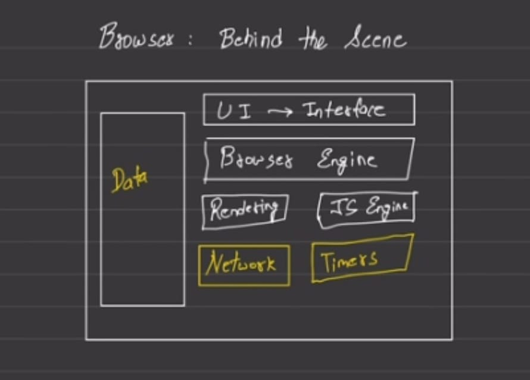
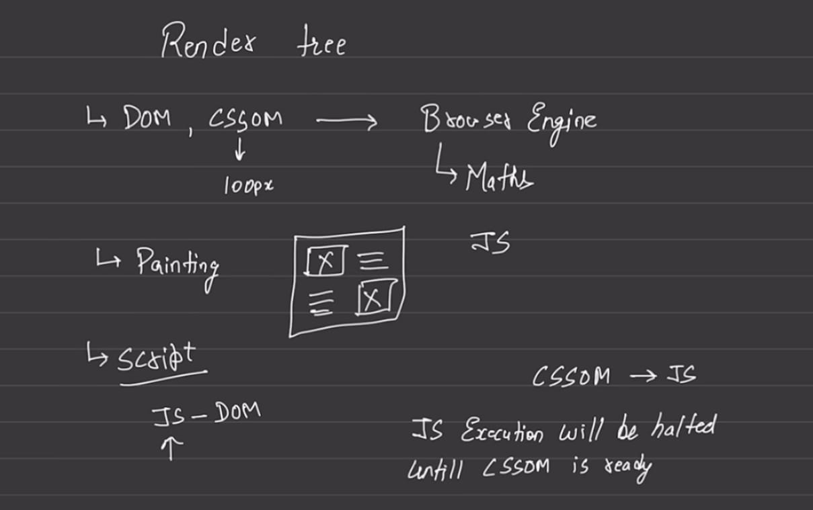
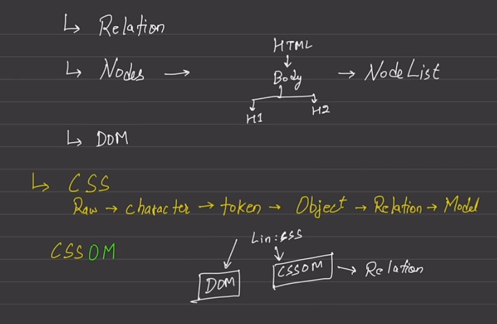
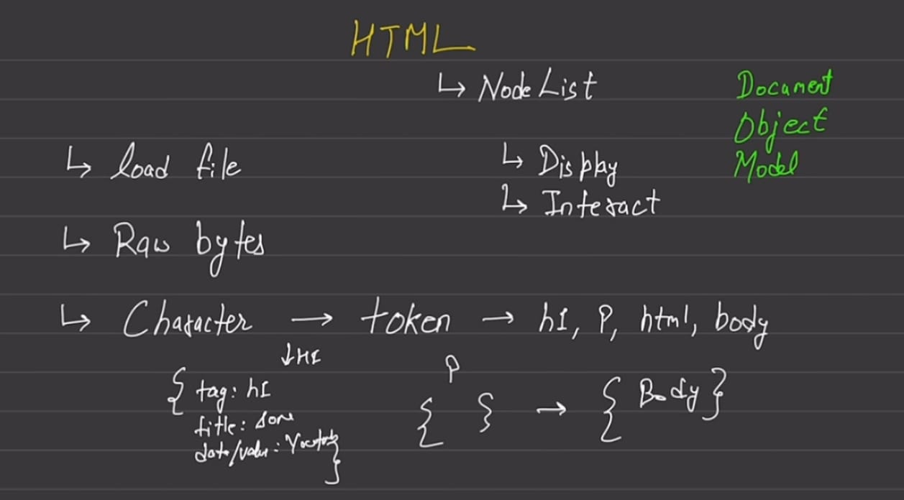

# Browser Architecture

---

## **1. Data**

- **Role:** Persistent and session-level storage system.  
- **Works:** Maintains cookies, cache, history, localStorage, sessionStorage, IndexedDB.  
- **Example:** Login tokens, saved preferences, cached CSS/JS for faster reloads.

---

## **2. UI Interface**

- **Role:** Visible user layer.  
- **Works:** Displays address bar, bookmarks, tabs, navigation controls.  
- **Example:** Clicking a bookmark or back button triggers engine actions.

---

## **3. Browser Engine**

- **Role:** Coordinator between UI and rendering/JS/network subsystems.  
- **Works:** Controls rendering pipeline, updates pages, handles reflows and repaint requests.  
- **Example:** Detects that a new DOM node was added, tells rendering engine to repaint.

---

## **4. Rendering Engine**

- **Role:** Converts web code (HTML, CSS) into pixels.  
- **Works (sequence):**  
  1. Parse HTML → DOM  
  2. Parse CSS → CSSOM  
  3. Combine → Render Tree  
  4. Layout → Calculate geometry  
  5. Paint → Rasterize and draw to screen  
- **Example:** Displays YouTube home feed layout.

---

## **5. JavaScript Engine**

- **Role:** Executes JavaScript and interacts with DOM APIs.  
- **Works:** Parses → Compiles → Executes → Updates DOM and event loop queue.  
- **Example:** Handles “Like” button click, dynamically updates color or count.

---

## **6. Network**

- **Role:** Handles all HTTP/HTTPS, DNS, SSL, WebSocket connections.  
- **Works:**  
  1. Performs DNS lookup  
  2. Establishes TCP/SSL  
  3. Fetches resources  
  4. Streams data to rendering and JS engines  
- **Example:** Downloads HTML, JS, and images for a website.

---

## **7. Timers (Browser Component)**

- **Role:** Event scheduling subsystem tied to the **Event Loop**.  
- **Works:**  
  - Keeps track of delayed or periodic tasks.  
  - Integrates with event loop queue to execute callbacks when time expires.  
  - Internal to browser core (beyond simple `setTimeout`).  
- **Example:**  
  - Rendering engine schedules reflow for next frame (~16ms).  
  - JS engine manages async callbacks and timeouts.

---

## **Real Sequence Example**

When you open `https://twitter.com`:

1. **UI Interface** → User enters URL.  
2. **Network** → Sends HTTP request.  
3. **Data** → Reads cookies and cache.  
4. **Browser Engine** → Starts page load orchestration.  
5. **Rendering Engine** → Parses HTML/CSS → draws page.  
6. **JavaScript Engine** → Executes scripts → updates DOM/UI.  
7. **Timers** → Schedules frame updates, async tasks, and network polling.

---

## HTML Processing

---

## **NodeList**

- **Definition:** A live or static list of nodes (elements, text, comments) returned by DOM methods such as `document.querySelectorAll()` or `childNodes`.  
- **Role:** Represents structured relationships between HTML nodes for **display** and **interaction**.  
- **Example:**  

```js
  const list = document.querySelectorAll("p");
  console.log(list[0].textContent);
````

- **Display Relation:** Helps rendering engine map elements to pixels.
- **Interaction Relation:** JS modifies or listens to nodes via DOM APIs.

---

## **HTML Processing Flow**

1. **Load File**

   - Browser fetches raw HTML bytes.
2. **Decode Bytes**

   - Converts to characters based on encoding (UTF-8, etc.).
3. **Tokenization**

   - Converts character stream into tokens (e.g., `<html>`, `<h1>`, `<p>`).
4. **Tree Construction**

   - Tokens become nodes → DOM tree.
5. **NodeList & DOM Interaction**

   - DOM accessible by JS for manipulation and rendering.

---

## CSSOM (CSS Object Model)

---

- **Role:** Represents CSS rules as an object model parallel to the DOM.
- **Process:**

  1. CSS parsed into tree structure (CSSOM).
  2. Combined with DOM → Render Tree.
- **Parallelism:** HTML and CSS parse **in parallel**.
- **Blocking Behavior:**

  - CSS can **block JavaScript execution** until CSSOM is ready.
  - Ensures scripts don’t manipulate incomplete styles.
- **Example:**
  A `<script>` tag after `<link rel="stylesheet">` will wait for the stylesheet to load before running.

---

## **Execution Order Summary**

1. HTML parsing → DOM built.
2. CSS parsing → CSSOM built (can block JS).
3. JS executes after CSSOM ready.
4. DOM + CSSOM → Render Tree → Layout → Paint.

---

## **References**





